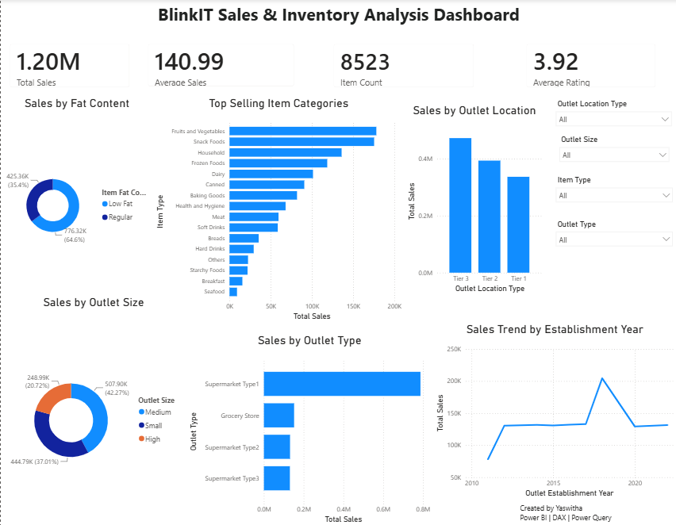

# BlinkIT Sales & Inventory Analysis

This project is a Power BI dashboard created to analyze BlinkIT grocery sales and outlet performance.

The dashboard looks at sales across different product categories, outlet types, outlet sizes, outlet locations, and establishment years. I used Power Query for data cleaning and transformation and DAX to create the required measures.

## Dashboard



## Tools Used

- Power BI
- Power Query
- DAX
- Microsoft Excel

## What I Analyzed

The dashboard covers:

- Total sales and average sales
- Average product rating
- Sales by item fat content
- Top-selling item categories
- Sales by outlet location
- Sales by outlet size
- Sales by outlet type
- Sales trend by outlet establishment year

It also includes slicers that allow the user to filter the dashboard by outlet location type, outlet size, item type, and outlet type.

## Data Preparation

I used Power Query to prepare the dataset before building the dashboard. The main steps included:

- Promoting the first row as headers
- Correcting data types
- Cleaning inconsistent values
- Standardizing item fat content categories
- Checking for missing and invalid values
- Preparing the data for analysis

## Key Findings

Some of the main findings from the analysis are:

- Low Fat products account for about 64.6% of total sales.
- Fruits and Vegetables have the highest sales among the item categories.
- Tier 3 outlets generate the highest sales among the outlet location types.
- Supermarket Type1 has the highest sales among the outlet types.
- Medium-sized outlets contribute the largest share of sales.

## DAX Measures

Some of the measures used in the dashboard include:

```DAX
Total Sales = SUM('BlinkIT Grocery Data'[Sales])
Average Sales = AVERAGE('BlinkIT Grocery Data'[Sales])
Item Count = DISTINCTCOUNT('BlinkIT Grocery Data'[Item Identifier])
Average Rating = AVERAGE('BlinkIT Grocery Data'[Rating])
```

## Project Structure

```text
blinkit-sales-inventory-analysis/
│
├── Dashboard/
│   └── BlinkIT_Sales_Inventory_Analysis.pbix
│
├── Dataset/
│   └── BlinkIT Grocery Data.xlsx
│
├── Images/
│   └── dashboard.png
│
└── README.md
```

## How to Use

Download the repository and open the `.pbix` file using Power BI Desktop.

You can use the slicers on the dashboard to explore the sales data from different perspectives.

## Author

Yaswitha

Power BI | DAX | Power Query | Data Analysis
